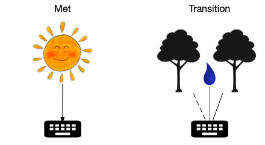

```{r setup, include=FALSE}
knitr::opts_chunk$set(echo = TRUE)
library(readr)
library(tidyr)
library(dplyr)
library(DT)
```


```{r, include=FALSE}

# Expand a string: look for patterns like x,y,z within a possibly
# larger string, and break them apart at the commas
# So "Hello test,apple2,my_fun" -> 
# c("Hello test", "Hello apple2", "Hello my_fun")
expand_string <- function(s, p = "(\\w+,)+\\w+") {
    matches <- regexpr(p, s)
    
    if(matches > 0) {
        subs <- strsplit(regmatches(s, matches), ",")[[1]]
        s <- rep(s, length(subs))
        newmatches <- regexpr(p, s)
        regmatches(s, newmatches) <- trimws(subs)
    }
    s
}

# Expand a data frame: look for patterns like x,y,z within entries and,
# for that row, replicate it and use expand_string to break apart the x,y,z
# Multiple expansions within a row are OK as long as they're the same length
expand_df <- function(df) {
    results <- list()
    for(i in seq_len(nrow(df))) {
        dfr <- df[i,]  # row we're working on
        # Figure out max expansion (may be 1) and replicate row that many times
        expand_lens <- sapply(dfr, function(x) length(expand_string(x)))
        new_df <- dfr[rep(1, max(expand_lens)),]
        
        # Can't have mismatches (except for 1-length)
        # E.g. "x,y" in one cell and "x,y,z" in another
        if(length(setdiff(unique(expand_lens), 1)) > 1) {
            stop("Row ", i, " has mismatched expansion entries")
        } 
        
        # For each column, expand its entry string as needed 
        if(nrow(new_df) > 1) {
            for(col in seq_along(new_df)) {
                new_df[col] <- expand_string(new_df[[1, col]])
            }    
        }
        results[[i]] <- new_df
    }
    
    bind_rows(results)
}
```

## Setup

Let's say we have one site (Crane Creek) with one plot.
The plot has a datalogger monitoring two trees, one with a deep sensor, as well
as soil moisture.




## Read the data

The **logger data table** is downloaded from the logger. 

```{r}
library(compasstools)
logger_data <- read_csv("logger_data.csv", show_col_types = FALSE)

datatable(logger_data) %>%
    formatStyle("Logger", color = "green")
```

The **plot table** provides treatment/plot/individual information based on `design_link`.

```{r}
plot_table <- read_csv("plot_table.csv", show_col_types = FALSE)
datatable(plot_table) %>% 
    formatStyle("design_link", color = "red") %>% 
    formatStyle("logger", color = "green")
```

Note that I'm using "comma notation" here in the plot table, so we expand it
before continuing:

```{r}
plot_table_ex <- expand_df(plot_table)
datatable(plot_table_ex) %>% 
    formatStyle("design_link", color = "red") %>% 
    formatStyle("logger", color = "green")
```

The **design table** links logger variables with their design (as specified in the plot table).

```{r}
design_table <- read_csv("design_table.csv", show_col_types = FALSE)
datatable(design_table) %>%
    formatStyle("design_link", color = "red") %>%
    formatStyle("loggernet_variable", color = "blue") %>% 
    formatStyle("scale_type", color = "lightgrey")
```


## Reshape logger data and join with design info

```{r}
logger_data %>% 
    # NOTE: I'm handling Timestamp different from everything else, as otherwise
    # the pivot_wider below fails; check with SC
    pivot_longer(c(-Logger, -Timestamp), names_to = "loggernet_variable") %>%
    left_join(select(design_table, loggernet_variable, design_link, research_name),
              by = "loggernet_variable") %>% 
    filter(!is.na(design_link)) ->  # in a real pipeline we'd error if not found
    dat1
datatable(dat1)
```

## Join with plot data

```{r}
dat1 %>% 
    left_join(plot_table_ex, by = c("Logger" = "logger", "design_link")) %>% 
    select(-Logger, -note) ->
    dat2
datatable(dat2)
```

## Reshape for final output

```{r}
dat2 %>% 
    select(-design_link, -loggernet_variable) %>% 
    pivot_wider(names_from = "research_name", values_from = "value") %>% 
    datatable()
```

## A little test

Define a test data frame:

```{r}
test <- tribble(~x,               ~y,          ~comment,
                "sapflux(1)",     "y1",        "no expansion",
                "logger,S11,S12", "y2",        "x expands, y replicates",
                "logger",         "y3a,y3b",   "y expands, x replicates",
                "sapflux(2,3)",   "y4a,y4b",   "x and y (same length) both expand"
#               "sapflux(2,3,4)", "y4a,y4b",   "this would cause a mismatch error"
)
datatable(test)
```

Expand it:

```{r}
datatable(expand_df(test))
```
