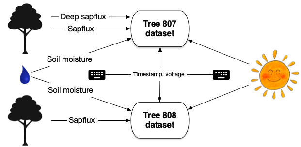

```{r setup, include=FALSE}
knitr::opts_chunk$set(echo = TRUE)
library(readr)
library(tidyr)
library(dplyr)
library(DT)
```


```{r, include=FALSE}

# Expand a string: look for patterns like x,y,z within a possibly
# larger string, and break them apart at the commas
# So "Hello A,B2,C" -> c("Hello A", "Hello B2", "Hello C")
# It also handles numerical sequences: "x1:3" -> c("x1", "x2", "x3")
# Comma expansions are performed before colon expansions:
# "A,B1:3,C" -> c("A", "B1", "B2", "B3", "C")
expand_string <- function(s, expand_comma = TRUE, expand_colon = TRUE) {
    # Look for 1+ "words" (letters, digits, underscores, possibly with a colon)
    # followed by commas (and perhaps white space), and then a final word
    if(expand_comma) {
        COMMA_PATTERN <- "(\\w+:?\\w*,\\s*)+\\w+:?\\w*"
        matches <- regexpr(COMMA_PATTERN, s)
        if(matches > 0) {
            subs <- strsplit(regmatches(s, matches), ",")[[1]]
            s <- rep(s, length(subs))
            newmatches <- regexpr(COMMA_PATTERN, s)
            regmatches(s, newmatches) <- trimws(subs)
            # Recurse once to look for possible colon expansions
            s <- unlist(sapply(s, expand_string, expand_comma = FALSE, USE.NAMES = FALSE))
        }
    } else if(expand_colon) {
        # Look for two numbers separated by a colon, with optional white space 
        COLON_PATTERN <- "\\d+\\s*:\\s*\\d+"
        matches <- regexpr(COLON_PATTERN, s)
        if(matches > 0) {
            subs <- strsplit(regmatches(s, matches), ":")[[1]]
            subs <- seq.int(from = subs[1], to = subs[2])
            s <- rep(s, length(subs))
            newmatches <- regexpr(COLON_PATTERN, s)
            regmatches(s, newmatches) <- subs
        }
    }
    
    s
}

# Expand a data frame: look for patterns like x,y,z within entries and,
# for that row, replicate it and use expand_string to break apart the x,y,z
# Multiple expansions within a row are OK as long as they're the same length
expand_df <- function(df) {
    results <- list()
    for(i in seq_len(nrow(df))) {
        dfr <- df[i,]  # row we're working on
        # Figure out max expansion (may be 1) and replicate row that many times
        expand_lens <- sapply(dfr, function(x) length(expand_string(x)))
        new_df <- dfr[rep(1, max(expand_lens)),]
        
        # Can't have mismatches (except for 1-length)
        # E.g. "x,y" in one cell and "x,y,z" in another
        if(length(setdiff(unique(expand_lens), 1)) > 1) {
            stop("Row ", i, " has mismatched expansion entries")
        } 
        
        # For each column, expand its entry string as needed 
        if(nrow(new_df) > 1) {
            for(col in seq_along(new_df)) {
                new_df[col] <- expand_string(new_df[[1, col]])
            }    
        }
        results[[i]] <- new_df
    }
    
    bind_rows(results)
}
```

## Setup

Let's say we have one site (Crane Creek) with one plot.
The plot has a datalogger monitoring two trees, one with a deep sensor, as well
as soil moisture. There's also a separate datalogger monitoring PAR.


The data flow for this setup looks like this:



Notice that the data flows for soil moisture, timestamp, and battery voltage 
are **one-to-many**: they are _plot level_ and so go to all trees' data.
The PAR datalogger is _site level_ and goes to all plots.

## Read the data

The **plot table captures the data flows above** based on `design_link`,
and provides treatment/plot/individual information .

```{r}
plot_table <- read_csv("plot_table.csv", show_col_types = FALSE)
datatable(plot_table) %>% 
    formatStyle("design_link", color = "red")
```

Note that this plot table uses "comma notation", so expand it
before continuing:

```{r}
plot_table_ex <- expand_df(plot_table)
datatable(plot_table_ex) %>% 
    formatStyle("design_link", color = "red")
```

The **design table** links logger variables with their `design_link`
as given in the plot table. This link can either be a specific measurement name
(e.g. `S807`) or a group (`logger`).

```{r}
design_table <- read_csv("design_table.csv", show_col_types = FALSE)
datatable(design_table) %>%
    formatStyle("design_link", color = "red") %>%
    formatStyle("loggernet_variable", color = "blue")
```

Finally, the two **logger data tables** are downloaded from the logger.

```{r}
library(compasstools)
logger_data1 <- read_csv("logger_data300.csv", show_col_types = FALSE)
datatable(logger_data1) %>%
    formatStyle("Logger", color = "green")

logger_data2 <- read_csv("logger_data302.csv", show_col_types = FALSE)
datatable(logger_data2) %>%
    formatStyle("Logger", color = "green")
```


## Reshape logger data and join with design info

```{r}
# Logger and Timestamp are 'magic fields' that always travel with data,
# so we handle them differently
ld1 <- pivot_longer(logger_data1, c(-Logger, -Timestamp), names_to = "loggernet_variable")
ld2 <- pivot_longer(logger_data2, c(-Logger, -Timestamp), names_to = "loggernet_variable")

ld1 %>%
    bind_rows(ld2) %>% 
    left_join(design_table, by = c("Logger", "loggernet_variable")) %>% 
    select(-scale_type) %>% 
    filter(!is.na(design_link)) ->  # in a real pipeline we'd error if not found
    dat1
datatable(dat1) %>% 
    formatStyle("design_link", color = "red") %>% 
    formatStyle("Logger", color = "green")
```

## Join with plot data

This is a crucial step because **this join is potentially one-to-many**:
more than one plot table entry may list a given `design_link`.

```{r}
dat1 %>% 
    right_join(plot_table_ex, by = "design_link") %>% 
    select(-note) ->
    dat2
datatable(dat2)
```

## Reshape for final output

```{r}
dat2 %>% 
    select(-design_link, -loggernet_variable, -Logger) %>% 
    pivot_wider(names_from = "research_name", values_from = "value") %>% 
    datatable()
```

## A little test

Define a test data frame:

```{r, echo=FALSE}
test <- tribble(~x,               ~y,          ~comment,
                "sapflux(1)",     "y1",        "no expansion",
                "logger,S11,S12", "y2",        "x expands; y replicates",
                "logger",         "y3a, y3b",   "y expands; x replicates (space)",
                "sapflux(2,3)",   "y4a,y4b",   "x and y (same length) both expand",
                #               "sapflux(2,3,4)", "y4a,y4b",   "this would cause a mismatch error",
                "sapflux(1:3)",   "a,b,c",     "sequence (colon) expansion",
                "a,b1:2,c",       "x",         "comma AND colon expansion"
)
datatable(test)
```

Expand it:

```{r}
datatable(expand_df(test), options = list(pageLength = 50))
```
