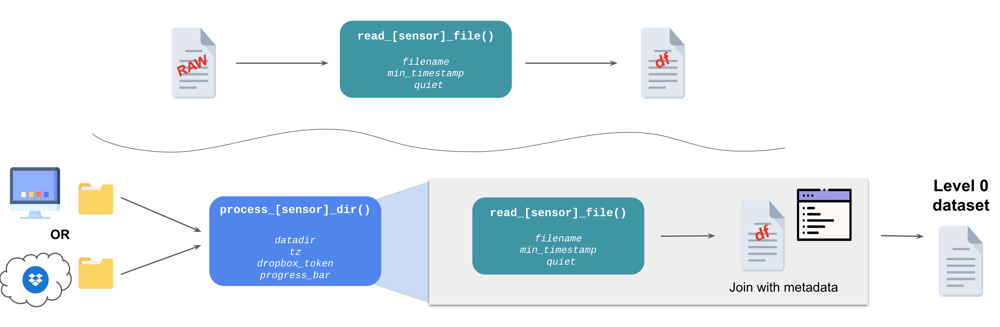

```{r setup, include=FALSE}
knitr::opts_chunk$set(echo = TRUE, message = FALSE)
pacman::p_load(compasstools, kableExtra, readr, dplyr, DT)
```

 *Figure | Flowchart of potential pathways of using `compasstools`* for sapflow sensor data processing

## Raw file 

```{r}
fn <- system.file("PNNL_11_sapflow_1min.dat", package = "compasstools")
dat_raw <- readLines(fn)
kable(dat_raw) %>% scroll_box(width = "100%")
```

## Functions {.tabset}
### `read_sapflow_file()` {.tabset .tabset-fade .tabset-pills}

The `read_sapflow_file` function reads a raw sapflow file, returning it as a data frame with minimal processing (the logger ID is extracted from the header and added as a column, but nothing else).

#### Example

```{r}
dat1 <- read_sapflow_file(fn)
kable(dat1) %>% kable_styling("striped") %>% scroll_box(width = "100%")
```

#### Function Code 

```{r}
print(read_sapflow_file)
```

### `process_sapflow_dir()` {.tabset .tabset-fade .tabset-pills}

The `process_sapflow_dir` function reads a folder of one or more raw sapflow files, returning them concatenated into a single data frame. The "Timestamp" column is parsed into a 'real' timestamp (i.e., `PosixCT` with time zone), and the data are reshaped into a long form with one observation per row.

#### Example

```{r}
td <- tempdir()
newfile <- file.path(td, "sapflow.dat")
writeLines(dat_raw, con = newfile)
dat2 <- process_sapflow_dir(td, tz = "EST")
kable(head(dat2)) %>% kable_styling("striped") %>% scroll_box(width = "100%")
```

#### Function Code

```{r}
print(read_sapflow_file)
```

## Joining with Metadata

We have an inventory file that includes site and location information about the sensors...

```{r}
inventory <- read_csv("sapflow_inventory copy.csv")

DT::datatable(inventory)
```

... and it gets joined with our dataframe to produce a Level 0 dataset.

```{r, results="asis"}
sapflow_l0 <- dat2 %>% left_join(inventory, by = c("Logger", "Port"))
kable(head(sapflow_l0)) %>% kable_styling("striped") %>% scroll_box(width = "100%")
```

